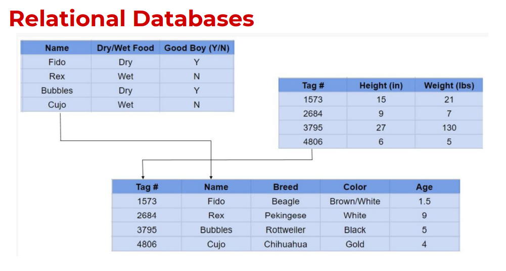
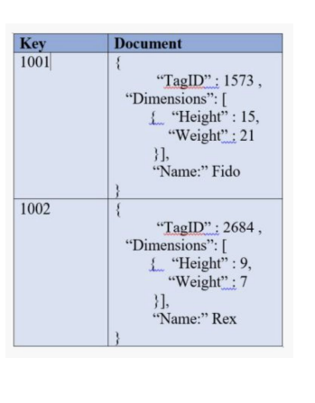

# SQL Fundamentals

## Relational Databases :

- A relational database is one that **stores data in tables .** The relationship between each data point is clear and searching through those relationships is relatively easy, **The relationship between tables and field types is called  a scheme.** For relation databases, the schema must be clearly defined.

 

 

## Non - Relational Databasea : 
 

- A non-relational database is any database that **does not use the tabular schema of rows and columns** like in relational databases. Rather, **its storage model is optimized for the type of data it's storing.**

- They also known as **NOSql Databases** where **NOSql** stands for "**N**ot **O**nly" **Sql**.

<table>
  <tr>
      <th></th>
      <th> There are four different types of NoSQL databases. 
        
    
    Document-oriented databases –
    
    Also known as a document store,
    this database is designed for
    storing, retrieving and managing 
    document-oriented information.
    
    Document databases usually pair each 
    key with a complex data structure 
    (called a document).

    Key-Value Stores – 
    
    This is a database that uses 
    different keys where each key
    is associated with only one value 
    in a collection. Think of it as a 
    dictionary. This is one of the simplest
    database types among NoSQL databases.

    Wide-Column Stores – 
    
    This database uses tables, rows, 
    and columns, but unlike a 
    relational database, the names and 
    format of the columns can vary from
    row to row in the same table.
    
    
    Graph Stores – 
    
    A graph database uses graph structures
    for semantic queries with nodes, edges,
    and properties to represent and store data.

  </th>
  </tr>
</table>

 
