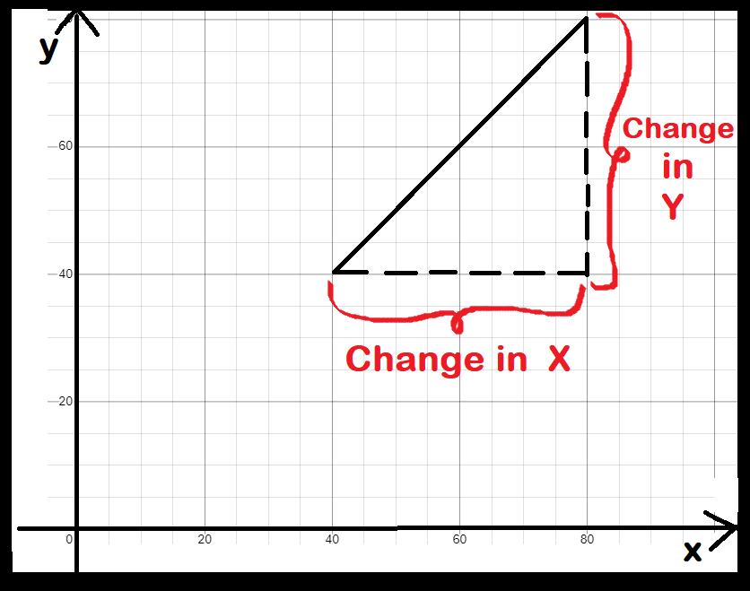
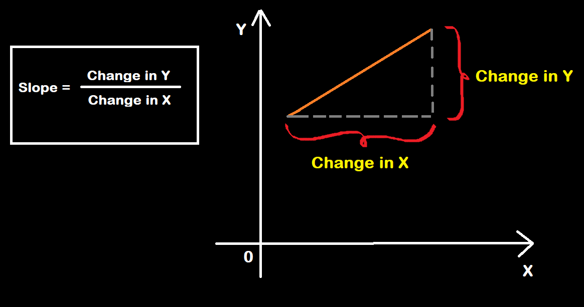
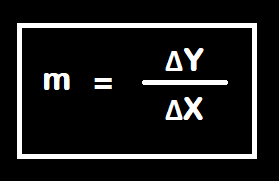

# Calculus For ML

**Calculus** : **"In terms of Physics, it is the study of continuous change"** 

- There are two well-known contributors in calculus:
  1. Newton (book name as Principia)
  2. Leibnitz

Speed : The rate of change of distance with respect to the time is the speed of that object.

> speed = distance / time

Distance vs Time graph :
  

## **Derivatives :** 

A derivative can be defined in two ways :

- Instantaneous rate of chang (Physics)
- Slope of a line at a specific point (Geometry)

A derivative outputs an expression we can use to calculate the instantaneous rate of change, (or) slope,  at a single point on a line.

> if **ΔX** is the **change in X** and **ΔY** is the **change in Y** and let the **slope (m)** then the formula will be,

The derivative of a function y = f(x) with respect to x is defined as :

