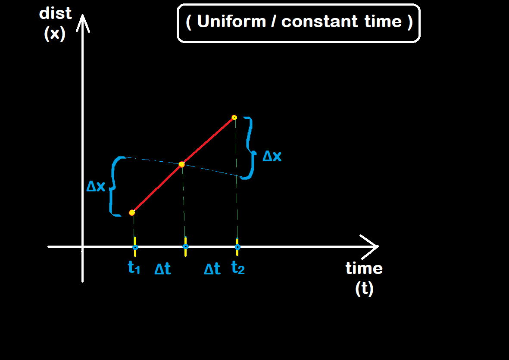

# Calculus For ML

**Calculus** : **"It is the study of continuous change"**

- There are two well-known contributors in calculus:
  1. Newton (book name as Principia)
  2. Leibnitz

Speed : The rate of change of distance with respect to the time is the speed of that object.

> speed = distance / time

Distance vs Time graph :

