# Introduction to Machine Learning

## What is Data Science?

- Data Science is a **multi-disciplinary field that uses scientific methods, algorithms, and systems to extract knowledge and insights from structured and unstructured data**. It combines elements from computer science, statistics, mathematics, and domain expertise to analyze data and make predictions, classifications, and decisions.

- Artificial Intelligence (AI) refers to the development of computer systems that can perform tasks that typically require human intelligence, such as visual perception, speech recognition, decision-making, and language translation. **AI is a broader concept that encompasses various subfields, including machine learning (ML), deep learning (DL), and natural language processing (NLP).**

- Machine Learning (ML) is a subset of AI that involves the use of algorithms and statistical models to enable computers to learn and improve from experience without being explicitly programmed.

- Deep Learning (DL) is a subfield of machine learning that uses artificial neural networks with multiple layers to perform complex tasks such as image and speech recognition.

- Business Knowledge refers to an understanding of business operations, strategy, and industry trends. It includes knowledge of markets, customers, competition, and regulatory environment. In data science, having a strong understanding of the business problem and domain expertise is critical for developing effective solutions.

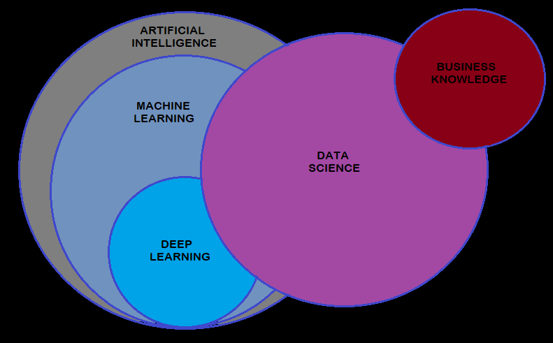

## Role of Data science

- The role of data science is to extract insights and knowledge from data and to provide decision-makers with actionable information. Data scientists use a combination of technical and business skills to work with stakeholders, gather and process data, build and validate models, and communicate findings and recommendations.

## Why it is important to Understand Data science?

- Data science is important because it enables organizations to make informed decisions based on data, and to turn data into competitive advantage. Data science applications can be found in many industries, such as healthcare, finance, retail, and transportation, to name a few. For example, in healthcare, data science can be used to develop predictive models to help diagnose diseases and to personalize treatments. In finance, data science can be used to detect fraudulent transactions and to predict stock prices. In retail, data science can be used to analyze customer behavior and to optimize pricing and inventory management.

# Machine Learning

- Learning is any process by which a system improves performance from experience.

- Machine Learning is concerned with computer programs that automatically improves their perfoemance through past experiences.

Heuristics and machine learning are two distinct approaches to solving problems and making decisions.

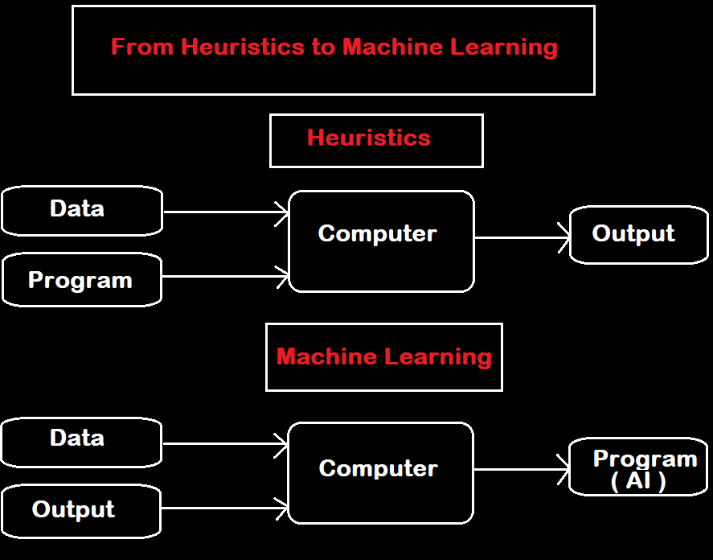

Heuristics are simple, intuitive strategies that are based on prior experience and knowledge, and are used to quickly find good solutions to problems, even though they may not always be the best. Heuristics are often used when an exact solution is not possible or when a fast solution is more important than an optimal one.

Machine learning, on the other hand, is a data-driven approach that uses algorithms and statistical models to automatically improve the performance of a system by learning from data. Machine learning algorithms can be used for tasks such as classification, prediction, and clustering, and are typically used when a large amount of data is available.

In summary, heuristics are used for quick and efficient problem solving, while machine learning is used for data-driven problem solving and decision making.

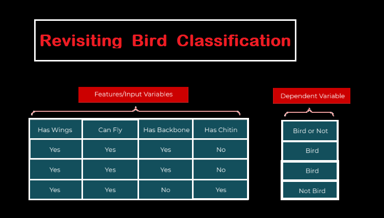

Here are the steps to classify a bird or not a bird using a machine learning approach with the independent variables "Has Wings", "Can Fly", "Has Backbone", "Has Chitin", and the class/target variable "Bird or not":

1. Collect and label a training dataset: Gather a set of examples of birds and non-birds, and label each example with the values of the independent variables and the class/target variable.

2. Choose a machine learning algorithm: Select a suitable supervised machine learning algorithm, such as decision tree or random forest, for binary classification problems like this.

3. Train the classifier: Use the labeled training data to train the machine learning algorithm. The algorithm will learn the relationships between the independent variables and the target variable, and create a model that can be used to make predictions.

4. Test the classifier: Evaluate the performance of the classifier on a separate, test dataset. This will give you an idea of how well the classifier will perform on new, unseen examples.

5. Use the classifier: Once the classifier has been trained and tested, you can use it to classify new examples by inputting the values of the independent variables and obtaining a prediction for the target variable. For example, if you input "Has Wings = Yes", "Can Fly = Yes", "Has Backbone = Yes", and "Has Chitin = No", the classifier will predict whether the example is a bird or not.

Note: The accuracy of the classifier will depend on the quality and size of the training data, as well as the choice of algorithm and its parameters. To improve the performance of the classifier, you may need to use feature engineering to create new variables based on the existing ones, or collect more training data to increase the size of the dataset.

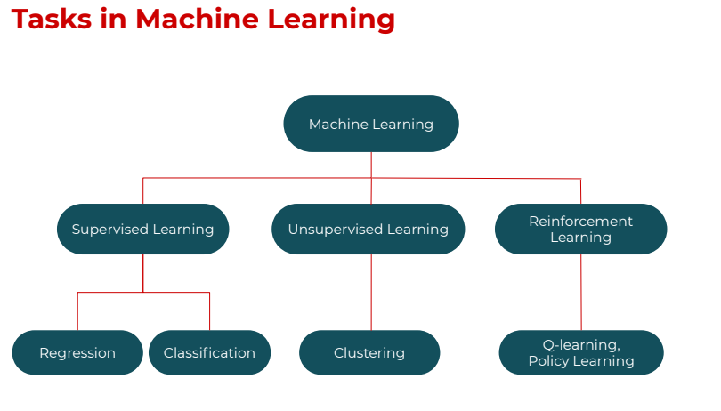

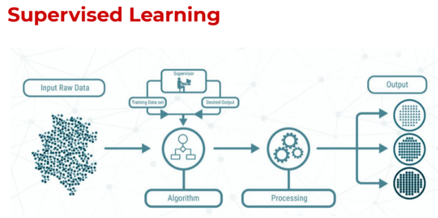

1. Supervised learning: In supervised learning, the algorithms are trained on labeled data, where the target or dependent variable is known. The goal of supervised learning is to learn a function that maps the input variables to the output variable, based on the labeled training data. The algorithm can then be used to make predictions for new, unseen examples. Supervised learning is commonly used for tasks such as classification and regression. Examples of supervised learning algorithms include logistic regression, decision trees, and support vector machines (SVM).

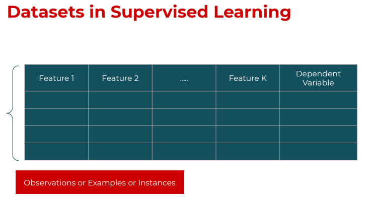

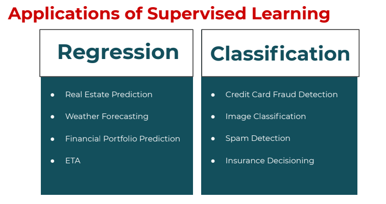

Real-life applications of supervised learning include image classification, spam filtering, credit risk analysis, and stock price prediction.

2. Unsupervised learning: In unsupervised learning, the algorithms are trained on unlabeled data, where the target variable is not known. The goal of unsupervised learning is to find patterns and structure in the data, such as grouping similar examples together. Unsupervised learning is commonly used for tasks such as clustering and dimensionality reduction. Examples of unsupervised learning algorithms include k-means clustering, principal component analysis (PCA), and autoencoders.

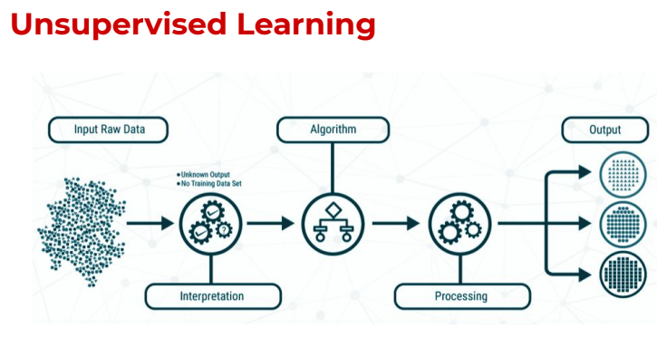

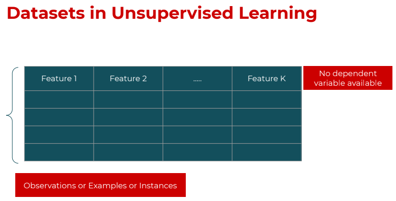

Real-life applications of unsupervised learning include market segmentation, customer segmentation, and anomaly detection.

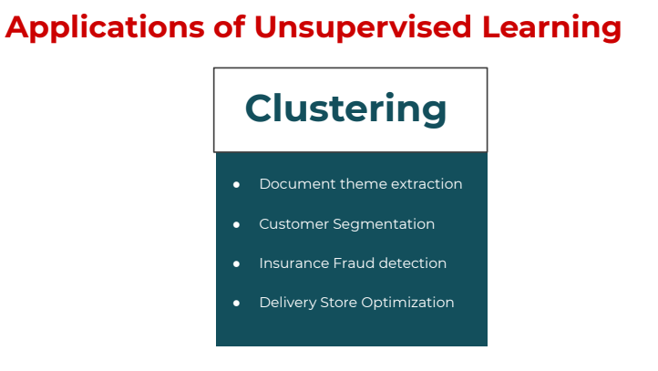

3. Reinforcement learning: In reinforcement learning, the algorithms learn from interactions with an environment by receiving rewards or penalties for certain actions. The goal of reinforcement learning is to learn a policy that maximizes the reward over time. Reinforcement learning is commonly used for tasks such as game playing and robotics. Examples of reinforcement learning algorithms include Q-learning and SARSA.

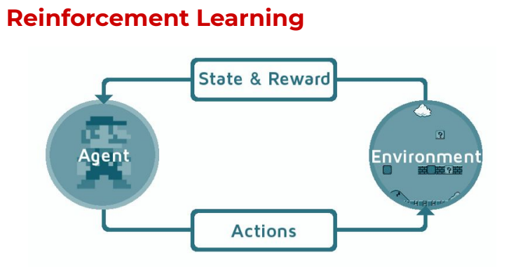

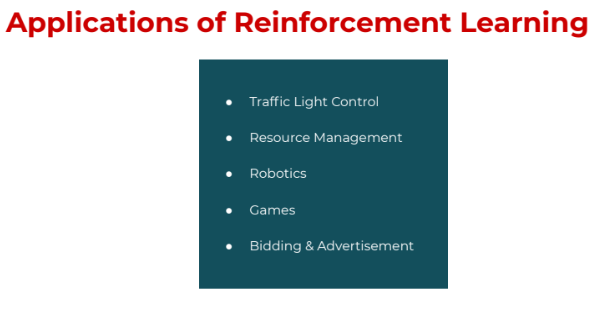

Real-life applications of reinforcement learning include controlling energy consumption in data centers, optimizing advertisements in online platforms, and playing and mastering video games.  

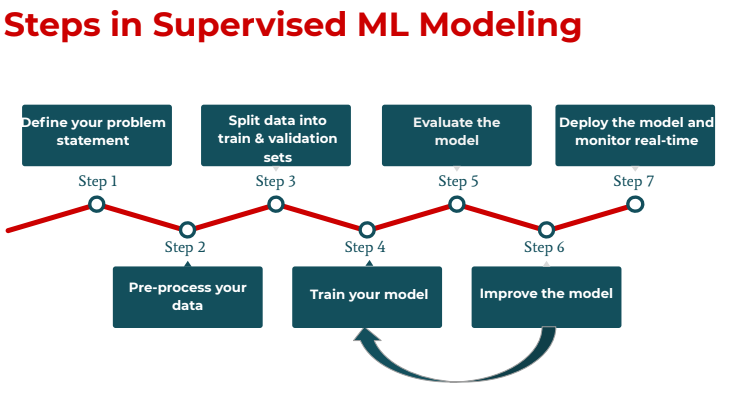

In summary, the type of dataset used for each type of machine learning is dependent on the nature of the problem and the type of algorithm used. Supervised learning requires labeled data, unsupervised learning requires unlabeled data, and reinforcement learning requires a set of rules for receiving rewards and penalties based on actions taken in an environment.

